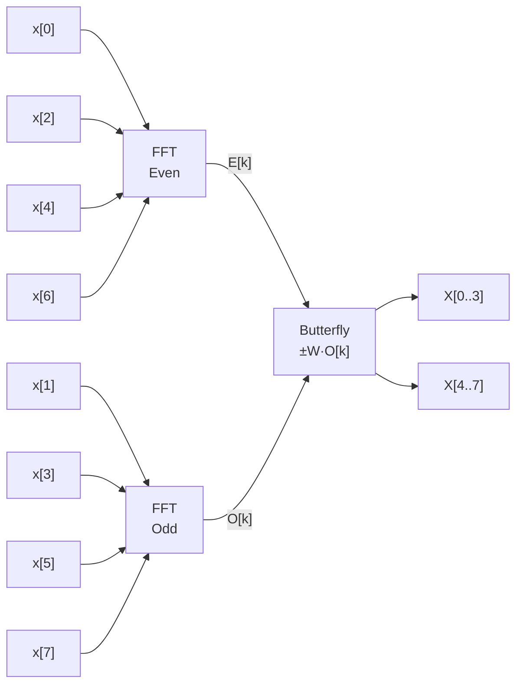
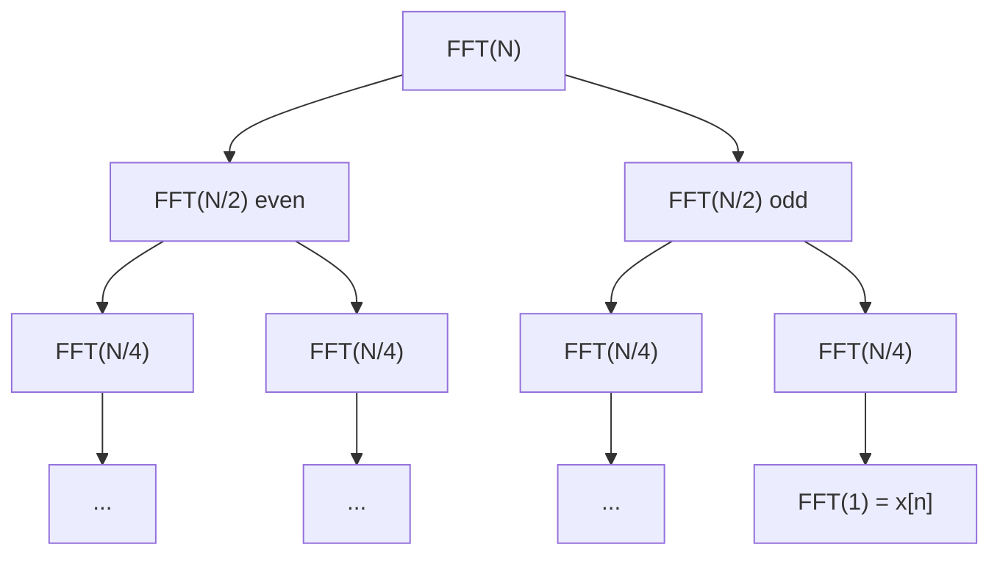

# Fast Fourier Transform — Canonical Documentation

**Package:** `algorithms/fft`  
**Version:** 1.0.0  
**Category:** Signal Processing

---

## 1. Mathematical Definition

The **Discrete Fourier Transform (DFT)** maps a finite sequence $x[n]$ of length $N$
to its frequency-domain representation $X[k]$:

$$X[k] = \sum_{n=0}^{N-1} x[n]\,e^{-j\frac{2\pi}{N}kn}, \quad k = 0, 1, \ldots, N-1$$

The **Inverse DFT** recovers the original sequence:

$$x[n] = \frac{1}{N}\sum_{k=0}^{N-1} X[k]\,e^{j\frac{2\pi}{N}kn}$$

---

## 2. Cooley-Tukey Radix-2 DIT Decomposition

For $N = 2^m$, split the DFT into even- and odd-indexed sub-sequences:

$$X[k] = \underbrace{\sum_{n=0}^{N/2-1} x[2n]\,e^{-j\frac{2\pi}{N/2}kn}}_{E[k]} + W_N^k \underbrace{\sum_{n=0}^{N/2-1} x[2n+1]\,e^{-j\frac{2\pi}{N/2}kn}}_{O[k]}$$

where the **twiddle factor** is $W_N = e^{-j2\pi/N}$.

Using the periodicity of $E$ and $O$ (length $N/2$):

$$\boxed{X[k]       = E[k] + W_N^k\,O[k]}$$
$$\boxed{X[k+N/2]   = E[k] - W_N^k\,O[k]}$$

This **butterfly** operation halves the problem size at each stage, yielding
$\mathcal{O}(N\log_2 N)$ complexity.

---

## 3. Butterfly Diagram (single stage, N = 8)



---

## 4. Recursion Tree



---

## 5. Key Properties

| Property | Formula |
|----------|---------|
| Linearity | $\mathcal{F}\{ax+by\} = a X + b Y$ |
| Parseval | $\sum\|x[n]\|^2 = \frac{1}{N}\sum\|X[k]\|^2$ |
| Shift | $x[n-n_0] \leftrightarrow X[k]\,W_N^{kn_0}$ |
| Conjugate symmetry (real input) | $X[N-k] = X^*[k]$ |

---

## 6. API Reference

### `fft(x) → list[complex]`

Radix-2 DIT FFT.  Input length must be a power of 2.

### `ifft(X) → list[complex]`

Inverse FFT via conjugation identity: $\text{IFFT}\{X\} = \overline{\text{FFT}\{\bar{X}\}}/N$.

### `magnitude_spectrum(x) → list[float]`

Single-sided magnitude spectrum (positive frequencies only, length $N/2+1$).

---

## 7. Usage Example

```python
import cmath, math
from algorithms.fft.src.fft import fft, magnitude_spectrum

N = 64
fs = 1000.0       # Hz
f0 = 100.0        # Hz
x = [cmath.exp(2j * math.pi * f0 * n / fs) for n in range(N)]

X = fft(x)
mag = magnitude_spectrum(x)
peak_bin = mag.index(max(mag))          # should equal round(N * f0 / fs)
print(f"Peak at bin {peak_bin} → {peak_bin * fs / N:.1f} Hz")
```

---

## 8. Changelog

See [`../CHANGELOG.md`](../CHANGELOG.md).
