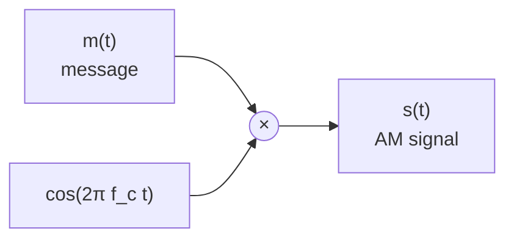
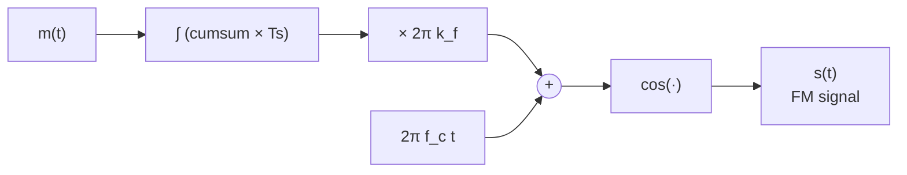
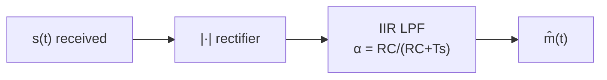

# Modulation & Demodulation — Canonical Documentation

**Package:** `algorithms/modulation`  
**Version:** 1.0.0  
**Category:** Signal Processing / Communications

---

## 1. Amplitude Modulation (AM)

### 1.1 DSB-SC (Double-Sideband Suppressed-Carrier)

$$s(t) = m(t)\,\cos(2\pi f_c t)$$

The message $m(t)$ **multiplies** the carrier directly; no carrier component is transmitted.

### 1.2 DSB-LC (Double-Sideband Large-Carrier)

$$s(t) = A_c\bigl[1 + k_a\,m(t)\bigr]\cos(2\pi f_c t)$$

| Symbol | Meaning |
|--------|---------|
| $A_c$ | Peak carrier amplitude |
| $k_a$ | Modulation index (0 < $k_a$ ≤ 1 to avoid overmodulation) |
| $f_c$ | Carrier frequency [Hz] |

### 1.3 Spectrum of AM DSB-LC

If $m(t) = A_m\cos(2\pi f_m t)$:

$$S(f) = \frac{A_c}{2}\bigl[\delta(f-f_c)+\delta(f+f_c)\bigr]
        + \frac{A_c k_a A_m}{4}\bigl[\delta(f-(f_c\pm f_m)) + \delta(f+(f_c\pm f_m))\bigr]$$

---

## 2. Frequency Modulation (FM)

$$s(t) = A_c\cos\!\left[2\pi f_c t + 2\pi k_f\int_0^t m(\tau)\,d\tau\right]$$

The **instantaneous frequency** is:

$$f_i(t) = f_c + k_f\,m(t)$$

In discrete time (sampling period $T_s = 1/f_s$):

$$\phi[n] = 2\pi f_c\,n T_s + 2\pi k_f T_s\!\sum_{i=0}^{n} m[i], \qquad s[n] = A_c\cos(\phi[n])$$

---

## 3. Demodulation

### 3.1 AM Envelope Detector

Full-wave rectifier followed by a first-order IIR low-pass filter:

$$y_r[n] = |s[n]|, \qquad y[n] = \alpha\,y[n-1] + (1-\alpha)\,y_r[n]$$

where $\alpha = \frac{RC}{RC + T_s}$, $RC = \frac{1}{2\pi f_{\text{cut}}}$.

### 3.2 FM Discriminator

Estimate instantaneous frequency via the discrete phase derivative:

$$\hat{f}_i[n] \approx \frac{\arcsin\!\bigl(s[n]\,c[n-1] - s[n-1]\,c[n]\bigr)}{2\pi T_s}$$

then recover the message:

$$\hat{m}[n] = \frac{\hat{f}_i[n] - f_c}{k_f}$$

---

## 4. Signal Flow Diagrams

### AM Modulator



### FM Modulator



### AM Demodulation



---

## 5. API Reference

| Function | Description |
|----------|-------------|
| `am_modulate_dsbsc(message, fc, fs)` | DSB-SC modulator |
| `am_modulate_dsblc(message, fc, fs, carrier_amplitude, modulation_index)` | DSB-LC modulator |
| `am_demodulate(signal, fc, fs, lp_cutoff)` | Envelope detector |
| `fm_modulate(message, fc, fs, kf, carrier_amplitude)` | FM modulator |
| `fm_demodulate(signal, fc, fs, kf, lp_cutoff)` | FM discriminator |

All functions raise `ValueError` if $f_c \leq 0$, $f_s \leq 0$, or $f_c \geq f_s/2$ (Nyquist).

---

## 6. Usage Example

```python
import math
from algorithms.modulation.src.modulation import am_modulate_dsblc, am_demodulate

fs, fc = 44100.0, 5000.0
message = [math.sin(2 * math.pi * 200 * n / fs) for n in range(4096)]

modulated = am_modulate_dsblc(message, fc, fs, carrier_amplitude=1.0, modulation_index=0.8)
recovered  = am_demodulate(modulated, fc, fs)
```

---

## 7. Changelog

See [`../CHANGELOG.md`](../CHANGELOG.md).
