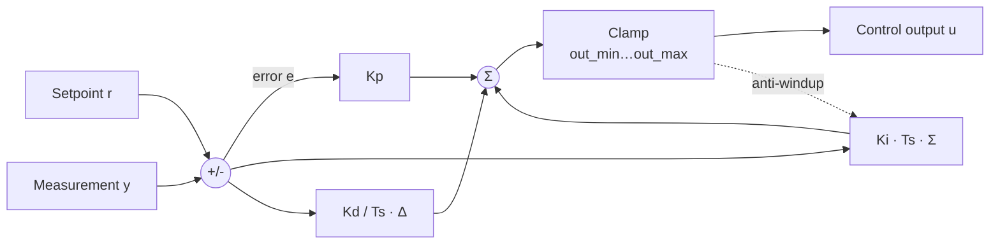
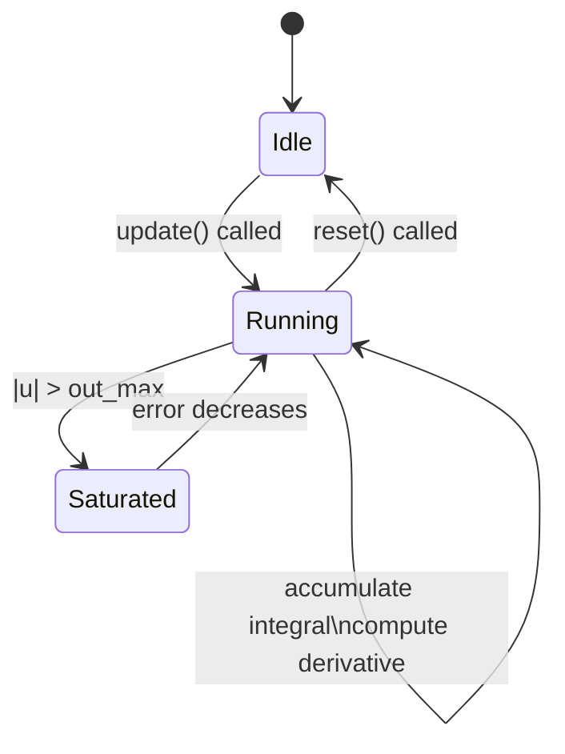

# PID Controller — Canonical Documentation

**Package:** `algorithms/pid`  
**Version:** 1.0.0  
**Category:** Control Systems

---

## 1. Mathematical Definition

A **Proportional-Integral-Derivative (PID) controller** computes a control signal
$u[k]$ to drive a process variable towards a desired setpoint.

Given the error signal:

$$e[k] = r[k] - y[k]$$

where $r[k]$ is the setpoint and $y[k]$ is the measured output, the **position-form**
discrete PID is:

$$u[k] = K_p\,e[k] + K_i\,T_s\sum_{i=0}^{k}e[i] + \frac{K_d}{T_s}(e[k]-e[k-1])$$

| Symbol | Meaning |
|--------|---------|
| $K_p$ | Proportional gain |
| $K_i$ | Integral gain |
| $K_d$ | Derivative gain |
| $T_s$ | Sampling period (s) |

---

## 2. Anti-Windup

When the output is saturated ($u[k] \notin [u_{\min}, u_{\max}]$), the integral
accumulation is **frozen** to prevent integral windup:

$$\text{if } u_{\min} < u_{\text{raw}}[k] < u_{\max}: \quad I[k] = I[k-1] + e[k]\,T_s$$

---

## 3. Block Diagram



---

## 4. State Machine



---

## 5. API Reference

### `PIDController(kp, ki, kd, dt, out_min=-inf, out_max=+inf)`

| Parameter | Type | Description |
|-----------|------|-------------|
| `kp` | float | Proportional gain |
| `ki` | float | Integral gain |
| `kd` | float | Derivative gain |
| `dt` | float | Sampling period [s] |
| `out_min` | float | Output lower bound |
| `out_max` | float | Output upper bound |

### `update(setpoint, measurement) → float`

Advances the controller by one time step. Returns the clamped control output.

### `reset() → None`

Clears the integral accumulator and the previous-error register.

---

## 6. Usage Example

```python
from algorithms.pid.src.pid import PIDController

pid = PIDController(kp=1.2, ki=0.5, kd=0.05, dt=0.01, out_min=-10, out_max=10)

plant_state = 0.0
for step in range(1000):
    u = pid.update(setpoint=1.0, measurement=plant_state)
    plant_state += u * 0.01  # simple integrating plant
```

---

## 7. Changelog

See [`../CHANGELOG.md`](../CHANGELOG.md).
