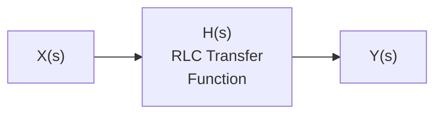
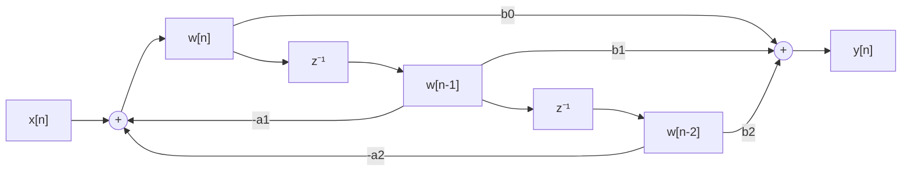
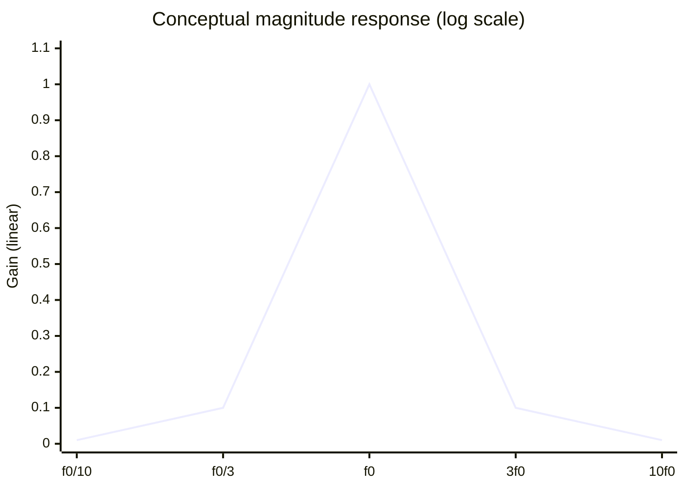

# RLC Filter — Canonical Documentation

**Package:** `algorithms/rlc`  
**Version:** 1.0.0  
**Category:** Signal Processing / Analogue Filters

---

## 1. Circuit Topology

A **series RLC circuit** with component values $R$ (Ω), $L$ (H), $C$ (F):

```
    R        L
o──┤├──┬──(((──┬── o
       │       │
       C      GND
       │
      GND
```

The transfer function depends on which component the output is taken across.

---

## 2. Analogue Transfer Functions H(s)

### 2.1 Low-Pass (output across C)

$$H_{LP}(s) = \frac{\omega_0^2}{s^2 + \frac{\omega_0}{Q}\,s + \omega_0^2}$$

### 2.2 High-Pass (output across L)

$$H_{HP}(s) = \frac{s^2}{s^2 + \frac{\omega_0}{Q}\,s + \omega_0^2}$$

### 2.3 Band-Pass (output across R)

$$H_{BP}(s) = \frac{\frac{\omega_0}{Q}\,s}{s^2 + \frac{\omega_0}{Q}\,s + \omega_0^2}$$

**Key parameters:**

| Symbol | Formula | Meaning |
|--------|---------|---------|
| $\omega_0$ | $1/\!\sqrt{LC}$ | Resonant (natural) angular frequency [rad/s] |
| $Q$ | $\omega_0 L / R$ | Quality factor (sharpness of resonance) |
| $f_0$ | $\omega_0 / (2\pi)$ | Resonant frequency [Hz] |
| $BW$ | $R / L$ | −3 dB bandwidth [rad/s] |

---

## 3. Discretisation — Bilinear Transform (Tustin)

Substitute $s \leftarrow \dfrac{2}{T_s}\dfrac{z-1}{z+1}$ with $T_s = 1/f_s$:

$$H(z) = \frac{b_0 + b_1 z^{-1} + b_2 z^{-2}}{1 + a_1 z^{-1} + a_2 z^{-2}}$$

**Difference equation (Direct Form II):**

$$w[n] = x[n] - a_1 w[n-1] - a_2 w[n-2]$$
$$y[n] = b_0 w[n] + b_1 w[n-1] + b_2 w[n-2]$$

---

## 4. Block Diagrams

### Analogue Filter (Laplace domain)



### Discrete IIR Implementation (Direct Form II)



---

## 5. Frequency Response



*(Band-pass shown; low-pass and high-pass responses roll off on the respective side.)*

---

## 6. API Reference

### `RLCFilter(R, L, C, fs, filter_type)`

| Parameter | Type | Description |
|-----------|------|-------------|
| `R` | float | Resistance [Ω] |
| `L` | float | Inductance [H] |
| `C` | float | Capacitance [F] |
| `fs` | float | Sampling frequency [Hz] |
| `filter_type` | FilterType | `LOW_PASS`, `HIGH_PASS`, or `BAND_PASS` |

### `process(signal) → list[float]`

Filter the input sequence sample by sample (stateful).

### `reset() → None`

Zero the internal filter state.

### `resonant_frequency_hz` *(property)*

Returns $f_0 = \omega_0 / (2\pi)$ in Hz.

### Convenience constructors

```python
rlc_lowpass(R, L, C, fs)   → RLCFilter(LOW_PASS)
rlc_highpass(R, L, C, fs)  → RLCFilter(HIGH_PASS)
rlc_bandpass(R, L, C, fs)  → RLCFilter(BAND_PASS)
```

---

## 7. Usage Example

```python
import math
from algorithms.rlc.src.rlc import rlc_lowpass

R, L, C, fs = 1.0, 1e-3, 1e-6, 96000.0

filt = rlc_lowpass(R, L, C, fs)
print(f"f0 = {filt.resonant_frequency_hz:.1f} Hz,  Q = {filt.Q:.2f}")

N = 8192
signal = [math.sin(2 * math.pi * 1000 * n / fs) for n in range(N)]
filtered = filt.process(signal)
```

---

## 8. Changelog

See [`../CHANGELOG.md`](../CHANGELOG.md).
